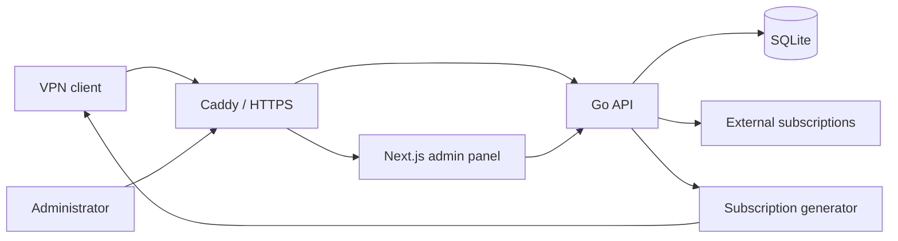

<p align="center">
  <strong>🇬🇧 English</strong> · <a href="README_RU.md">🇷🇺 Русский</a>
</p>

<div align="center">

# 🔗 SubShare

**Self-hosted VPN subscription hub for managing, aggregating and delivering client-ready profiles.**

Keep local and external VPN configurations in one place, assign them to users, and publish controlled subscription URLs — without managing VPN nodes themselves.

[](https://github.com/romanpodg/SubShare-Go/actions/workflows/ci.yml)
[](https://github.com/romanpodg/SubShare-Go/tags)


[](LICENSE)

</div>

---

## 📖 About

SubShare is a lightweight self-hosted service for building and managing VPN subscriptions.

It combines a **Go backend**, **Next.js admin panel**, **SQLite**, **Caddy** and **Docker Compose**. SubShare is intended for situations where VPN profiles already exist and need to be imported, organized, assigned to users and delivered through one controlled subscription layer.

> [!IMPORTANT]
> SubShare **does not deploy, configure or control VPN/Xray nodes** and does not measure real VPN traffic. It manages connection profiles and subscription delivery.

## 🖥️ Interface

<p align="center">
  
</p>

<p align="center">
  <b>Dashboard</b><br>
  Overview of users, profiles, sources and subscription activity.
</p>

<p align="center">
  
</p>

<p align="center">
  <b>User management</b><br>
  Manage users, subscription access and assigned VPN profiles.
</p>

<p align="center">
  
</p>

<p align="center">
  <b>External sources</b><br>
  Preview and synchronize profiles from external subscriptions.
</p>

---

## ✨ Features

- **Users & subscriptions** — expiration, statuses, one-time activation, persistent subscription URLs and HWID/device limits.
- **VPN profiles** — local profiles, informational keys, categories, ordering, bulk operations and availability checks.
- **External sources** — HTTP(S) subscriptions, preview-before-import, synchronization history and SSRF-aware fetching.
- **Profile identity** — credential-safe semantic fingerprints for synchronization and duplicate detection.
- **Multiple output formats** — `plain`, `base64`, `xray-json`, `mihomo` and `sing-box`.
- **Response rules** — choose subscription output using headers, User-Agent, regex conditions, templates and fallback rules.
- **Administration** — Dashboard, Users, Keys, Sources, Templates, Response Rules, Settings, Admins and Audit.
- **Access control** — `owner`, `operator`, `viewer` roles and scoped API tokens.
- **Security** — encrypted credential-bearing profile storage, CSRF protection, trusted-proxy handling, rate limiting and structured audit logging.
- **Persistence** — versioned SQLite migrations, automatic backups and persistent Docker volumes.

---

## 🧩 Supported protocols

| Protocol | URI | Notes |
| --- | --- | --- |
| VLESS | `vless://` | Supported |
| VMess | `vmess://` | Supported |
| Trojan | `trojan://` | Supported |
| Shadowsocks | `ss://` | SIP002/SIP022; structured output depends on method/plugin support |
| Hysteria 2 | `hysteria2://`, `hy2://` | Structured output depends on fields and target format |
| TUIC v5 | `tuic://` | Supported with compatibility-aware structured generation |
| TUIC v4 | `tuic://` | Legacy compatibility input; raw delivery only |

`plain` and `base64` are the most compatibility-oriented delivery modes. Structured generators deliberately exclude entries that cannot be represented safely instead of silently changing their connectivity semantics.

---

## 🏗️ Architecture



The backend is the source of truth for authentication, configuration validation, profile parsing, persistence and subscription delivery.

---

## 🚀 Quick start

### Requirements

For the recommended deployment you need:

- Git
- Docker Engine / Docker Desktop
- Docker Compose v2

Go, Node.js, SQLite and Caddy are provided by the project containers.

> [!IMPORTANT]
> `PROFILE_FINGERPRINT_KEY` is mandatory. Generate it **once**, keep it private and preserve it across normal restarts.

### Linux / Ubuntu

```bash
git clone https://github.com/romanpodg/SubShare-Go.git
cd SubShare-Go

cp .env.example .env
FINGERPRINT_KEY="$(docker run --rm alpine:3.22.1 sh -c 'od -An -N32 -tx1 /dev/urandom | tr -d " \n"')"
sed -i "s/^PROFILE_FINGERPRINT_KEY=.*/PROFILE_FINGERPRINT_KEY=${FINGERPRINT_KEY}/" .env

bash scripts/start.sh
```

### Windows 10/11

Docker Desktop must be running in **Linux containers** mode.

```powershell
git clone https://github.com/romanpodg/SubShare-Go.git
Set-Location SubShare-Go

Copy-Item .env.example .env

$key = docker run --rm alpine:3.22.1 sh -c 'od -An -N32 -tx1 /dev/urandom | tr -d " \n"'
$content = (Get-Content .env) -replace '^PROFILE_FINGERPRINT_KEY=.*$', "PROFILE_FINGERPRINT_KEY=$key"
[System.IO.File]::WriteAllLines(
    (Join-Path (Get-Location) '.env'),
    $content,
    [System.Text.UTF8Encoding]::new($false)
)

powershell -ExecutionPolicy Bypass -File .\scripts\start.ps1
```

For local use, keep:

```env
BASE_URL=http://localhost
```

For a public installation, change it before startup:

```env
BASE_URL=https://sub.example.com
```

You may leave `ADMIN_PASSWORD=` empty. When the administrators table is empty, the startup script generates the initial owner password, stores it in the private `.env`, and prints it after a successful first startup.

The Docker stack also initializes the profile encryption keyring, applies versioned database migrations and waits for the services to become healthy.

Open:

```text
http://localhost/admin/login
```

Default bootstrap username:

```text
admin
```

---

## 🧭 First steps

A typical setup is:

1. Sign in to `/admin/login`.
2. Add local profiles in **Keys**, or configure an external subscription in **Sources**.
3. Preview external changes before importing them.
4. Create a user.
5. Assign the required profiles.
6. Adjust templates, response rules or subscription settings if needed.
7. Copy the user's subscription URL and add it to the VPN client.
8. Use synchronization history and **Audit** when troubleshooting.

> [!CAUTION]
> Treat subscription URLs as bearer secrets. Anyone with a valid URL may be able to retrieve the corresponding subscription.

---

## 🌐 Public deployment

Set:

```env
BASE_URL=https://sub.example.com
```

Then make sure:

- DNS points to the server;
- TCP ports **80** and **443** are reachable;
- UDP **443** is allowed if you want HTTP/3;
- no other service occupies ports 80/443.

Caddy obtains and renews HTTPS certificates automatically.

`BASE_URL` must contain only the origin — no trailing slash, path, query string or credentials.

---

## 🐳 Operations

Common Docker commands:

| Task | Command |
| --- | --- |
| Service status | `docker compose ps` |
| Follow logs | `docker compose logs -f` |
| Backend logs | `docker compose logs -f backend` |
| Restart services | `docker compose restart` |
| Stop containers | `docker compose down` |
| Start existing stack | `docker compose up -d --wait` |

> [!CAUTION]
> Do **not** run `docker compose down -v` unless you intentionally want to destroy persistent volumes. The data volume contains the SQLite database and profile encryption keyring.

### Backup

When `BACKUP_PATH` is enabled, SubShare maintains an integrity-checked SQLite backup in persistent storage.

Linux:

```bash
bash scripts/backup.sh
```

Windows:

```powershell
.\scripts\backup.ps1
```

The scripts export a matching pair to `backups/`:

```text
app_<timestamp>.db
keyring_<timestamp>.json
```

Also preserve the private `.env`, especially `PROFILE_FINGERPRINT_KEY`.

A database containing encrypted profile credentials is not independently restorable without its matching encryption keyring.

### Update

Create a fresh backup, then update the repository and rerun the normal start script:

```bash
git pull --ff-only
bash scripts/start.sh
```

PowerShell:

```powershell
git pull --ff-only
powershell -ExecutionPolicy Bypass -File .\scripts\start.ps1
```

Existing `.env` values and persistent Docker volumes are preserved.

---

## ⚙️ Configuration

The complete reference is in [`.env.example`](.env.example).

| Variable | Purpose |
| --- | --- |
| `ADMIN_USER` | Initial owner username; default `admin` |
| `ADMIN_PASSWORD` | Initial owner password; needed only while no administrators exist |
| `PROFILE_FINGERPRINT_KEY` | Stable HMAC secret for semantic profile fingerprints |
| `PROFILE_FINGERPRINT_PREVIOUS_KEYS` | Previous fingerprint keys temporarily retained during rotation |
| `PROFILE_ENCRYPTION_KEYRING_FILE` | File-backed encryption keyring |
| `PROFILE_ENCRYPTION_KEYRING_JSON` | Secret-manager alternative to the keyring file |
| `BASE_URL` | Public HTTP(S) origin |
| `PORT` | Go API listen port/address; default `8080` |
| `DB_PATH` | SQLite database path |
| `DB_JOURNAL_MODE` | SQLite journal mode; `WAL` by default |
| `CORS_ORIGINS` | Allowed browser origins |
| `TRUSTED_PROXIES` | Proxy IP/CIDR allowlist for forwarded client-IP headers |
| `SUBSCRIPTION_BODY_ENCODING` | Legacy fallback: `base64` or `plain` |
| `BACKUP_PATH` | Automatic backup path |
| `BACKUP_INTERVAL` | Backup interval, e.g. `1h` |
| `HAPP_CRYPTO_API_URL` | Optional trusted Happ encryption service |

### Fingerprint key rotation

When intentionally rotating `PROFILE_FINGERPRINT_KEY`:

1. generate a new key;
2. put the old key in `PROFILE_FINGERPRINT_PREVIOUS_KEYS`;
3. set the new active key;
4. synchronize every external source;
5. remove the old key only after synchronization succeeds everywhere.

Never use the administrator password as the fingerprint key.

---

## 💻 Local development

Requirements:

- Go 1.24+
- Node.js 22+
- npm

Create the encryption keyring once:

```bash
go run ./cmd/server bootstrap keyring data/keyring.json
```

Start the backend with the required environment variables.

Bash example:

```bash
export APP_ENV=development
export ADMIN_USER=admin
export ADMIN_PASSWORD='replace-with-a-strong-development-password'
export PROFILE_FINGERPRINT_KEY="$(openssl rand -hex 32)"
export PROFILE_ENCRYPTION_KEYRING_FILE="data/keyring.json"
export DB_PATH="data/app.db"
export BASE_URL="http://localhost:3000"

go run ./cmd/server
```

PowerShell example:

```powershell
$env:APP_ENV = "development"
$env:ADMIN_USER = "admin"
$env:ADMIN_PASSWORD = "replace-with-a-strong-development-password"
$env:PROFILE_ENCRYPTION_KEYRING_FILE = "data/keyring.json"
$env:DB_PATH = "data/app.db"
$env:BASE_URL = "http://localhost:3000"

$bytes = New-Object byte[] 32
$rng = [System.Security.Cryptography.RandomNumberGenerator]::Create()
$rng.GetBytes($bytes)
$rng.Dispose()
$env:PROFILE_FINGERPRINT_KEY = -join ($bytes | ForEach-Object { $_.ToString("x2") })

go run ./cmd/server
```

For persistent development data, reuse the same fingerprint key between restarts.

Start the frontend in a second terminal:

```bash
cd frontend
npm ci
npm run dev
```

Open `http://localhost:3000/admin/login`.

During development, Next.js proxies `/api/*` and `/sub/*` to the backend on `localhost:8080`.

---

## 🔌 API

The current administration API lives under:

```text
/api/v1
```

Common routes:

```text
GET  /health
POST /api/subscription/activate
GET  /sub/{subscription_id}
GET  /api/sub/{subscription_id}/info

GET  /api/v1/dashboard
GET  /api/v1/users
GET  /api/v1/keys
GET  /api/v1/sources
GET  /api/v1/jobs
GET  /api/v1/audit-events
GET  /api/v1/build-info
GET  /api/v1/openapi.yaml
```

See the full OpenAPI 3.1 specification:

[`cmd/server/openapi.yaml`](cmd/server/openapi.yaml)

Legacy `/api/admin/*` routes remain for compatibility in the current release. New integrations should use `/api/v1`.

API token scopes include:

```text
read
users:write
keys:write
settings:write
```

Token secrets are displayed once; only their hash is persisted.

---

## 🛡️ Security

SubShare treats VPN credentials, activation data and subscription identifiers as secrets.

Notable controls include:

- application-level authenticated encryption for credential-bearing profile URIs;
- keyed semantic fingerprints and blind indexes;
- Argon2id administrator password hashing with legacy bcrypt upgrade support;
- SSRF protection with DNS and redirect re-validation;
- CSRF protection for unsafe browser requests;
- HttpOnly/SameSite session cookies;
- trusted-proxy allowlisting;
- rate limiting on sensitive endpoints;
- role-based administration and scoped API tokens;
- structured audit logging designed not to expose raw VPN keys, activation codes, subscription IDs or HWIDs.

---

## 🧪 Testing & CI

Backend:

```bash
go test ./...
go vet ./...
```

Frontend:

```bash
cd frontend
npm ci
npx tsc --noEmit
npm run lint
npm test
npm run build
npm run test:e2e
```

GitHub Actions checks Go build/tests, migration compatibility, `go mod tidy`, Gitleaks, frontend typecheck/lint/tests, Playwright E2E, Docker builds, Caddy configuration and a clean-stack deployment smoke test.

---

## 📁 Project structure

```text
.
├── .github/workflows/       GitHub Actions CI
├── cmd/server/              Go application, API and migrations
│   └── openapi.yaml         OpenAPI 3.1 specification
├── internal/                Domain, persistence, protocol and security packages
├── frontend/                Next.js admin panel, Caddy and E2E tests
├── scripts/                 Start/update and backup helpers
├── .env.example             Environment reference
├── docker-compose.yml       Production stack
├── Dockerfile               Backend image
├── Makefile                 Build helpers
├── go.mod
└── LICENSE
```

### Stack

| Layer | Technology |
| --- | --- |
| Backend | Go 1.24, `net/http` |
| Database | SQLite via `modernc.org/sqlite` |
| Frontend | Next.js 16, React 19, TypeScript |
| Styling | Tailwind CSS |
| Reverse proxy | Caddy |
| Deployment | Docker Compose |
| API | OpenAPI 3.1 |
| Tests | Go tests, Vitest, Playwright |
| Secret scanning | Gitleaks |

---

## 🩺 Troubleshooting

**`PROFILE_FINGERPRINT_KEY` is missing**

Generate a 32-byte random hexadecimal key and store it in `.env` as 64 hexadecimal characters. Keep it stable across normal restarts.

**`BASE_URL` is invalid**

Use only an origin:

```env
BASE_URL=http://localhost
```

or:

```env
BASE_URL=https://sub.example.com
```

**Ports 80/443 are already in use**

Stop or reconfigure the service currently listening on those host ports.

**HTTPS certificate is not issued**

Check DNS, inbound TCP 80/443, `BASE_URL`, and:

```bash
docker compose logs frontend
```

**Existing profiles cannot be decrypted**

Restore the original matching profile encryption keyring. Creating a new keyring cannot recover data encrypted with a lost key.

**Need backend diagnostics**

```bash
docker compose logs --tail=200 backend
curl -fsS http://localhost/health
```

A healthy backend returns:

```json
{"status":"ok"}
```

---

## 📄 License

SubShare is released under the [Unlicense](LICENSE).

The software is provided as-is, without warranty.

---

## 💙 Acknowledgements

Special thanks to [Driics](https://github.com/Driics) for helping make SubShare simpler and better.

---

<div align="center">

**SubShare — one subscription layer for your VPN profiles.**

</div>