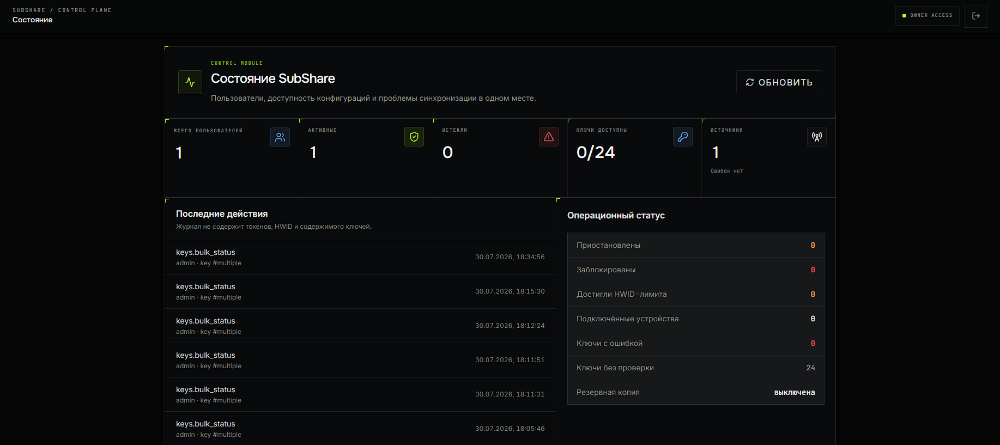
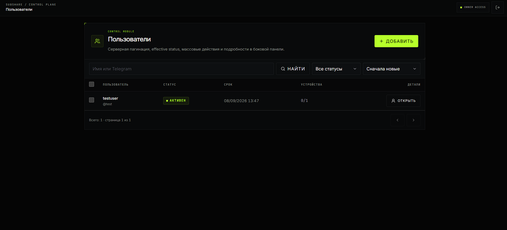
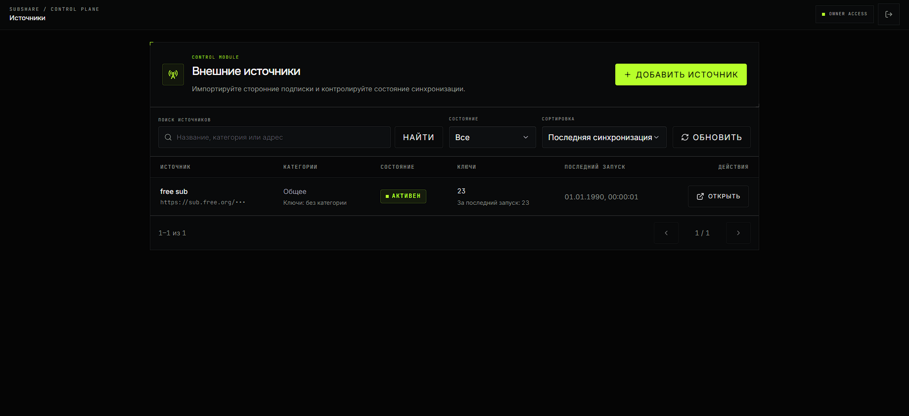
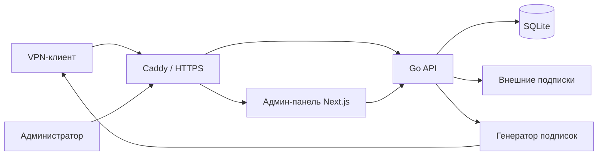

<p align="center">
  <a href="README_EN.md">🇬🇧 English</a> · <strong>🇷🇺 Русский</strong>
</p>

<div align="center">

# 🔗 SubShare

**Самостоятельно размещаемый центр VPN-подписок для управления, агрегации и выдачи готовых клиентских профилей.**

Храните локальные и внешние VPN-конфигурации в одном месте, назначайте их пользователям и публикуйте контролируемые URL подписок — без необходимости управлять самими VPN-узлами.

[](https://github.com/romanpodg/SubShare-Go/actions/workflows/ci.yml)
[](https://github.com/romanpodg/SubShare-Go/tags)


[](LICENSE)

</div>

---

## 📖 О проекте

SubShare — это легковесный self-hosted сервис для создания и управления VPN-подписками.

Он объединяет **Go-бэкенд**, **админ-панель на Next.js**, **SQLite**, **Caddy** и **Docker Compose**. SubShare предназначен для случаев, когда VPN-профили уже существуют и их необходимо импортировать, организовать, назначить пользователям и выдавать через единый контролируемый слой подписки.

> [!IMPORTANT]
> SubShare **не разворачивает, не настраивает и не управляет VPN/Xray-узлами**, а также не измеряет реальный VPN-трафик. Проект управляет профилями подключений и их выдачей через подписки.

## 🖥️ Интерфейс

<p align="center">
  
</p>

<p align="center">
  <b>Панель управления</b><br>
  Обзор пользователей, профилей, источников и активности подписок.
</p>

<p align="center">
  
</p>

<p align="center">
  <b>Управление пользователями</b><br>
  Управление пользователями, доступом к подпискам и назначенными VPN-профилями.
</p>

<p align="center">
  
</p>

<p align="center">
  <b>Внешние источники</b><br>
  Предварительный просмотр и синхронизация профилей из внешних подписок.
</p>

---

## ✨ Возможности

- **Пользователи и подписки** — сроки действия, статусы, одноразовая активация, постоянные URL подписок и ограничения по HWID/устройствам.
- **VPN-профили** — локальные профили, информационные ключи, категории, сортировка, массовые операции и проверки доступности.
- **Внешние источники** — HTTP(S)-подписки, предварительный просмотр перед импортом, история синхронизаций и загрузка с защитой от SSRF.
- **Идентификация профилей** — безопасные для учетных данных семантические отпечатки для синхронизации и обнаружения дубликатов.
- **Несколько форматов выдачи** — `plain`, `base64`, `xray-json`, `mihomo` и `sing-box`.
- **Правила ответа** — выбор формата подписки по заголовкам, User-Agent, regex-условиям, шаблонам и резервным правилам.
- **Администрирование** — Dashboard, Users, Keys, Sources, Templates, Response Rules, Settings, Admins и Audit.
- **Контроль доступа** — роли `owner`, `operator`, `viewer` и API-токены с ограниченными областями доступа.
- **Безопасность** — зашифрованное хранение профилей с учетными данными, CSRF-защита, работа с доверенными прокси, rate limiting и структурированный аудит.
- **Хранение данных** — версионируемые миграции SQLite, автоматические резервные копии и постоянные Docker volumes.

---

## 🧩 Поддерживаемые протоколы

| Протокол | URI | Примечание |
| --- | --- | --- |
| VLESS | `vless://` | Поддерживается |
| VMess | `vmess://` | Поддерживается |
| Trojan | `trojan://` | Поддерживается |
| Shadowsocks | `ss://` | SIP002/SIP022; структурированный вывод зависит от поддержки метода/плагина |
| Hysteria 2 | `hysteria2://`, `hy2://` | Структурированный вывод зависит от набора полей и целевого формата |
| TUIC v5 | `tuic://` | Поддерживается с генерацией структурированного вывода с учетом совместимости |
| TUIC v4 | `tuic://` | Поддержка устаревшего входного формата; только выдача исходного URI |

Режимы `plain` и `base64` обеспечивают максимальную совместимость. Структурированные генераторы намеренно исключают записи, которые невозможно безопасно представить в целевом формате, вместо незаметного изменения их параметров подключения.

---

## 🏗️ Архитектура



Бэкенд является источником истины для аутентификации, проверки конфигурации, разбора профилей, хранения данных и выдачи подписок.

---

## 🚀 Быстрый запуск

### Требования

Для рекомендуемого способа развертывания необходимы:

- Git
- Docker Engine / Docker Desktop
- Docker Compose v2

Go, Node.js, SQLite и Caddy уже входят в контейнеры проекта.

> [!IMPORTANT]
> `PROFILE_FINGERPRINT_KEY` обязателен. Сгенерируйте его **один раз**, храните в секрете и не меняйте при обычных перезапусках.

### Linux / Ubuntu

```bash
git clone https://github.com/romanpodg/SubShare-Go.git
cd SubShare-Go

cp .env.example .env
FINGERPRINT_KEY="$(docker run --rm alpine:3.22.1 sh -c 'od -An -N32 -tx1 /dev/urandom | tr -d " \n"')"
sed -i "s/^PROFILE_FINGERPRINT_KEY=.*/PROFILE_FINGERPRINT_KEY=${FINGERPRINT_KEY}/" .env

bash scripts/start.sh
```

### Windows 10/11

Docker Desktop должен быть запущен в режиме **Linux containers**.

```powershell
git clone https://github.com/romanpodg/SubShare-Go.git
Set-Location SubShare-Go

Copy-Item .env.example .env

$key = docker run --rm alpine:3.22.1 sh -c 'od -An -N32 -tx1 /dev/urandom | tr -d " \n"'
$content = (Get-Content .env) -replace '^PROFILE_FINGERPRINT_KEY=.*$', "PROFILE_FINGERPRINT_KEY=$key"
[System.IO.File]::WriteAllLines(
    (Join-Path (Get-Location) '.env'),
    $content,
    [System.Text.UTF8Encoding]::new($false)
)

powershell -ExecutionPolicy Bypass -File .\scripts\start.ps1
```

Для локального использования оставьте:

```env
BASE_URL=http://localhost
```

Для публичной установки измените значение перед запуском:

```env
BASE_URL=https://sub.example.com
```

Поле `ADMIN_PASSWORD=` можно оставить пустым. Если таблица администраторов пуста, скрипт запуска сгенерирует пароль первоначального владельца, сохранит его в приватном `.env` и выведет после успешного первого запуска.

Docker-стек также инициализирует keyring шифрования профилей, применяет версионируемые миграции базы данных и ожидает перехода сервисов в состояние healthy.

Откройте:

```text
http://localhost/admin/login
```

Имя пользователя по умолчанию при первоначальной инициализации:

```text
admin
```

---

## 🧭 Первые шаги

Обычная последовательность настройки:

1. Войдите через `/admin/login`.
2. Добавьте локальные профили в **Keys** или настройте внешнюю подписку в **Sources**.
3. Перед импортом просмотрите изменения из внешнего источника.
4. Создайте пользователя.
5. Назначьте ему необходимые профили.
6. При необходимости настройте шаблоны, правила ответа или параметры подписки.
7. Скопируйте URL подписки пользователя и добавьте его в VPN-клиент.
8. При поиске проблем используйте историю синхронизаций и раздел **Audit**.

> [!CAUTION]
> Относитесь к URL подписки как к секрету типа bearer token. Любой, у кого есть действительный URL, потенциально может получить соответствующую подписку.

---

## 🌐 Публичное развертывание

Укажите:

```env
BASE_URL=https://sub.example.com
```

После этого убедитесь, что:

- DNS указывает на ваш сервер;
- TCP-порты **80** и **443** доступны извне;
- UDP-порт **443** разрешен, если нужен HTTP/3;
- никакой другой сервис не занимает порты 80/443.

Caddy автоматически получает и обновляет HTTPS-сертификаты.

`BASE_URL` должен содержать только origin — без завершающего `/`, пути, query string или учетных данных.

---

## 🐳 Эксплуатация

Основные команды Docker:

| Задача | Команда |
| --- | --- |
| Статус сервисов | `docker compose ps` |
| Просмотр логов | `docker compose logs -f` |
| Логи бэкенда | `docker compose logs -f backend` |
| Перезапуск сервисов | `docker compose restart` |
| Остановка контейнеров | `docker compose down` |
| Запуск существующего стека | `docker compose up -d --wait` |

> [!CAUTION]
> **Не запускайте** `docker compose down -v`, если вы намеренно не хотите удалить постоянные volumes. В volume с данными находятся база SQLite и keyring шифрования профилей.

### Резервное копирование

Если включен `BACKUP_PATH`, SubShare поддерживает проверяемую на целостность резервную копию SQLite в постоянном хранилище.

Linux:

```bash
bash scripts/backup.sh
```

Windows:

```powershell
.\scripts\backup.ps1
```

Скрипты экспортируют согласованную пару файлов в каталог `backups/`:

```text
app_<timestamp>.db
keyring_<timestamp>.json
```

Также сохраняйте приватный `.env`, особенно `PROFILE_FINGERPRINT_KEY`.

Базу данных, содержащую зашифрованные учетные данные профилей, нельзя самостоятельно восстановить без соответствующего keyring шифрования.

### Обновление

Сначала создайте свежую резервную копию, затем обновите репозиторий и снова запустите обычный стартовый скрипт:

```bash
git pull --ff-only
bash scripts/start.sh
```

PowerShell:

```powershell
git pull --ff-only
powershell -ExecutionPolicy Bypass -File .\scripts\start.ps1
```

Существующие значения `.env` и постоянные Docker volumes сохраняются.

---

## ⚙️ Конфигурация

Полный список параметров находится в [`.env.example`](.env.example).

| Переменная | Назначение |
| --- | --- |
| `ADMIN_USER` | Имя первоначального владельца; по умолчанию `admin` |
| `ADMIN_PASSWORD` | Пароль первоначального владельца; нужен только пока в системе нет администраторов |
| `PROFILE_FINGERPRINT_KEY` | Стабильный HMAC-секрет для семантических отпечатков профилей |
| `PROFILE_FINGERPRINT_PREVIOUS_KEYS` | Предыдущие ключи отпечатков, временно сохраняемые при ротации |
| `PROFILE_ENCRYPTION_KEYRING_FILE` | Файловый keyring шифрования |
| `PROFILE_ENCRYPTION_KEYRING_JSON` | Альтернатива файлу keyring для secret manager |
| `BASE_URL` | Публичный HTTP(S) origin |
| `PORT` | Порт/адрес прослушивания Go API; по умолчанию `8080` |
| `DB_PATH` | Путь к базе SQLite |
| `DB_JOURNAL_MODE` | Режим журнала SQLite; по умолчанию `WAL` |
| `CORS_ORIGINS` | Разрешенные browser origins |
| `TRUSTED_PROXIES` | Список разрешенных IP/CIDR прокси для заголовков с реальным IP клиента |
| `SUBSCRIPTION_BODY_ENCODING` | Устаревший fallback: `base64` или `plain` |
| `BACKUP_PATH` | Путь для автоматических резервных копий |
| `BACKUP_INTERVAL` | Интервал резервного копирования, например `1h` |
| `HAPP_CRYPTO_API_URL` | Необязательный доверенный сервис шифрования Happ |

### Ротация ключа отпечатков

При намеренной ротации `PROFILE_FINGERPRINT_KEY`:

1. сгенерируйте новый ключ;
2. поместите старый ключ в `PROFILE_FINGERPRINT_PREVIOUS_KEYS`;
3. укажите новый активный ключ;
4. синхронизируйте каждый внешний источник;
5. удаляйте старый ключ только после успешной синхронизации всех источников.

Никогда не используйте пароль администратора в качестве ключа отпечатков.

---

## 💻 Локальная разработка

Требования:

- Go 1.24+
- Node.js 22+
- npm

Один раз создайте keyring шифрования:

```bash
go run ./cmd/server bootstrap keyring data/keyring.json
```

Запустите бэкенд с необходимыми переменными окружения.

Пример для Bash:

```bash
export APP_ENV=development
export ADMIN_USER=admin
export ADMIN_PASSWORD='replace-with-a-strong-development-password'
export PROFILE_FINGERPRINT_KEY="$(openssl rand -hex 32)"
export PROFILE_ENCRYPTION_KEYRING_FILE="data/keyring.json"
export DB_PATH="data/app.db"
export BASE_URL="http://localhost:3000"

go run ./cmd/server
```

Пример для PowerShell:

```powershell
$env:APP_ENV = "development"
$env:ADMIN_USER = "admin"
$env:ADMIN_PASSWORD = "replace-with-a-strong-development-password"
$env:PROFILE_ENCRYPTION_KEYRING_FILE = "data/keyring.json"
$env:DB_PATH = "data/app.db"
$env:BASE_URL = "http://localhost:3000"

$bytes = New-Object byte[] 32
$rng = [System.Security.Cryptography.RandomNumberGenerator]::Create()
$rng.GetBytes($bytes)
$rng.Dispose()
$env:PROFILE_FINGERPRINT_KEY = -join ($bytes | ForEach-Object { $_.ToString("x2") })

go run ./cmd/server
```

Для постоянных данных среды разработки используйте один и тот же fingerprint key между перезапусками.

Во втором терминале запустите фронтенд:

```bash
cd frontend
npm ci
npm run dev
```

Откройте `http://localhost:3000/admin/login`.

Во время разработки Next.js проксирует `/api/*` и `/sub/*` на бэкенд по адресу `localhost:8080`.

---

## 🔌 API

Текущий API администрирования расположен по префиксу:

```text
/api/v1
```

Основные маршруты:

```text
GET  /health
POST /api/subscription/activate
GET  /sub/{subscription_id}
GET  /api/sub/{subscription_id}/info

GET  /api/v1/dashboard
GET  /api/v1/users
GET  /api/v1/keys
GET  /api/v1/sources
GET  /api/v1/jobs
GET  /api/v1/audit-events
GET  /api/v1/build-info
GET  /api/v1/openapi.yaml
```

Полная спецификация OpenAPI 3.1:

[`cmd/server/openapi.yaml`](cmd/server/openapi.yaml)

Устаревшие маршруты `/api/admin/*` пока сохраняются для совместимости в текущем релизе. Новым интеграциям следует использовать `/api/v1`.

Области доступа API-токенов:

```text
read
users:write
keys:write
settings:write
```

Секрет токена показывается только один раз; в базе сохраняется только его хэш.

---

## 🛡️ Безопасность

SubShare рассматривает VPN-учетные данные, данные активации и идентификаторы подписок как секреты.

Основные механизмы защиты:

- аутентифицированное шифрование URI профилей с учетными данными на уровне приложения;
- ключевые семантические отпечатки и blind indexes;
- хэширование паролей администраторов с помощью Argon2id и поддержка обновления старых bcrypt-хэшей;
- SSRF-защита с повторной проверкой DNS и редиректов;
- CSRF-защита для небезопасных browser-запросов;
- session cookies с HttpOnly/SameSite;
- список доверенных прокси;
- rate limiting для чувствительных endpoints;
- ролевая модель администрирования и API-токены с ограниченными scopes;
- структурированный аудит, спроектированный так, чтобы не раскрывать исходные VPN-ключи, коды активации, ID подписок или HWID.

---

## 🧪 Тестирование и CI

Бэкенд:

```bash
go test ./...
go vet ./...
```

Фронтенд:

```bash
cd frontend
npm ci
npx tsc --noEmit
npm run lint
npm test
npm run build
npm run test:e2e
```

GitHub Actions проверяет сборку и тесты Go, совместимость миграций, `go mod tidy`, Gitleaks, typecheck/lint/tests фронтенда, Playwright E2E, сборку Docker-образов, конфигурацию Caddy и smoke test развертывания чистого стека.

---

## 📁 Структура проекта

```text
.
├── .github/workflows/       GitHub Actions CI
├── cmd/server/              Go-приложение, API и миграции
│   └── openapi.yaml         Спецификация OpenAPI 3.1
├── internal/                Доменные, persistence-, protocol- и security-пакеты
├── frontend/                Админ-панель Next.js, Caddy и E2E-тесты
├── scripts/                 Скрипты запуска, обновления и резервного копирования
├── .env.example             Справочник переменных окружения
├── docker-compose.yml       Production-стек
├── Dockerfile               Образ бэкенда
├── Makefile                 Вспомогательные команды сборки
├── go.mod
└── LICENSE
```

### Стек

| Слой | Технология |
| --- | --- |
| Бэкенд | Go 1.24, `net/http` |
| База данных | SQLite через `modernc.org/sqlite` |
| Фронтенд | Next.js 16, React 19, TypeScript |
| Стили | Tailwind CSS |
| Reverse proxy | Caddy |
| Развертывание | Docker Compose |
| API | OpenAPI 3.1 |
| Тесты | Go tests, Vitest, Playwright |
| Поиск секретов | Gitleaks |

---

## 🩺 Решение проблем

**`PROFILE_FINGERPRINT_KEY` отсутствует**

Сгенерируйте случайный 32-байтовый ключ в шестнадцатеричном виде и сохраните его в `.env` как 64 hex-символа. Не меняйте его при обычных перезапусках.

**`BASE_URL` имеет неверный формат**

Используйте только origin:

```env
BASE_URL=http://localhost
```

или:

```env
BASE_URL=https://sub.example.com
```

**Порты 80/443 уже заняты**

Остановите или перенастройте сервис, который сейчас использует эти порты хоста.

**HTTPS-сертификат не выдается**

Проверьте DNS, доступность входящих TCP 80/443, значение `BASE_URL` и логи:

```bash
docker compose logs frontend
```

**Существующие профили не удается расшифровать**

Восстановите исходный соответствующий keyring шифрования профилей. Создание нового keyring не позволит восстановить данные, зашифрованные утраченным ключом.

**Нужна диагностика бэкенда**

```bash
docker compose logs --tail=200 backend
curl -fsS http://localhost/health
```

Исправный бэкенд возвращает:

```json
{"status":"ok"}
```

---

## 📄 Лицензия

SubShare распространяется на условиях [Unlicense](LICENSE).

Программное обеспечение предоставляется «как есть», без каких-либо гарантий.

---

## 💙 Благодарности

Особая благодарность [Driics](https://github.com/Driics) за помощь в улучшении SubShare.

---

<div align="center">

**SubShare — единый слой подписки для ваших VPN-профилей.**

</div>
