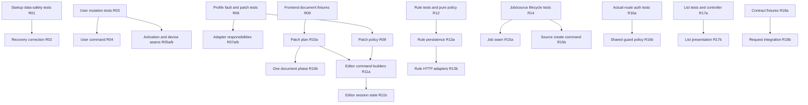

# Refactoring Batches

Audit basis: `main`, `3ab25a5d7aa4f2a28069330406d74f697ac1f1c3`. **Original audit plan; execution status below.** The original audit changed no production code or tests. Backlog IDs refer to [refactoring-backlog.md](refactoring-backlog.md). Each row is an independently reviewable/revertible unit; do not combine unrelated rows into one change. Tests land before extraction, and corrective behavior changes are explicitly distinguished.

## Current completion and next batch

R01 was validated at **a438377** and merged through [PR #7](https://github.com/romanpodg/SubShare-Go/pull/7) at **267811b**. R02 is complete in [PR #8](https://github.com/romanpodg/SubShare-Go/pull/8), with source validated at **a896708** and all six checks passing; see its [execution record](r02-startup-safety.md). See the [current backlog status](refactoring-backlog.md#current-implementation-status--2026-10-06) for remaining audit items.

The user explicitly requested R03 and the subsequent PATCH correction in that same PR, superseding the original one-PR-per-batch recommendation. Tests and corrections remain separate commits; the [R03 record](r03-user-mutations.md) and [PATCH record](subscription-patch-concurrency.md) distinguish contracts, validation evidence and remaining R04/R05 work.

The user then requested R04 within PR #8. Its [command-boundary record](r04-user-commands.md) describes creation transaction ownership, atomic deletion, response parity and the explicit unknown-deletion-outcome correction.

PR #8 is merged at **d87b122**. R05a started [PR #9](https://github.com/romanpodg/SubShare-Go/pull/9) from that merge: its [activation redemption record](r05a-activation-redemption.md) describes the HTTP-independent command, unchanged atomic claim and deterministic contention/failure assurance. All six hosted checks passed at ddf7154. The user then requested R05b continuation; its [device registration record](r05b-device-registration.md) owns the transaction/policy extraction and added assurance. The checked-out history includes the activation/device merge at **dc91072** and R06 characterization at **6a12236**.

**2026-10-08 continuation:** R07a merged through PR #11 at 1a7968b after all six checks and final automated review passed. R07b read/projection extraction is implemented and targeted/static/migration/strict CodeScene checks pass; full backend passes; final hosted scan/deployment acceptance remains. R08 is next. See [R07b](r07b-profile-reads.md) and [autonomous continuation](autonomous-continuation.md). **Historical 2026-10-07 continuation:** R07a extracts category and ordering persistence within the same adapter, retaining the R06 contracts. Its [execution record](r07a-category-ordering.md) owns local validation and the strict CodeScene average-complexity warnings. R07b is next; broader A01 and A02 work remains.

| Batch scope | Status | What remains |
| --- | --- | --- |
| R01 | Completed; Windows/Linux validated | Prerequisite for R02 |
| R02 | Completed; Windows/Linux/deployment validated; merged in PR #8 | No remaining R02 implementation |
| R03 | Test matrix, retry and PATCH corrections validated; merged in PR #8 | Retained as mutation contract evidence |
| R04 | Create/delete command boundary validated; merged in PR #8 | Retained as command-boundary evidence |
| R05a | Activation command/policy/HTTP boundary validated at ddf7154; included in dc91072 merge | Retained as activation contract evidence |
| R05b | Device registration transaction/policy boundary included in dc91072 merge | Retained as device contract evidence |
| R06 | Completed; characterization merged through PR #10 at ebd427f | Retained as R07/R08 prerequisites |
| R07a | Completed; PR #11 merged at 1a7968b | All six checks passed at 33631dd; final automated review clear |
| R07b | Completed; PR #12 merged at e9643e1 | All six checks passed at bb98e95; final automated review clear; see [record](r07b-profile-reads.md) |
| R08 | Completed; PR #13 merged at 3e4c333 | All six checks passed at 9c5fc34; final automated review clear; see [record](r08-update-policy.md) |
| R08c | Separate correction implemented; full Windows/storage/HTTP/static/migration/strict CodeScene checks pass | Hosted acceptance remains; see [record](r08c-assignment-rollback.md) |
| R09–R23 sub-batches | Not started | Original scopes/dependencies below remain authoritative |

Partial means acceptance criteria are not yet satisfied. The e3ceaba repository split predates R01 and does not complete A01. PR #7 and PR #8 are merged; dc91072 merges the activation and device continuation. R06 assurance and R07a extraction remain separate changes. The original plan and R01 execution notes below are historical records.

## Ordered execution plan

The original recommended first batch was **R01**, tests only; its execution status is recorded below. Then address R02's recovery correctness before extensive refactoring. The remaining order favors poorly protected business/data boundaries before UI restructuring; independent lanes need not wait for unrelated batches.

| Batch | Priority | Scope | Prerequisite Tests | Goal | Dependencies | Validation |
| --- | --- | --- | --- | --- | --- | --- |
| R01 — completed, Windows/Linux validated | P0/A00 | Startup/WAL characterization in server and storage tests only | Existing initialization/cleanup/migration tests; disposable subprocess harness | Prove committed crash-WAL versus junk sidecars and normal startup; record destructive current helper behavior | None | G, M; Windows and Linux disposable subprocess runs |
| R02 — completed | P0/A00 | `main.go` SQLite recovery branch, `storage/sqlite.go` cleanup contract | R01; initializer failure and real process-lock tests | **Corrective change:** fail closed and preserve committed data; separate journal negotiation from connection pragmas | R01 | G, M, D populated restart; failure injection |
| R03 — implemented | P1/A01 | User/legacy PUT/activation/device characterization tests and separate retry correction | Existing subscription core/HTTP fixtures plus registered routes and fault driver | Freeze mutation contracts; prove and correct exhausted create retries; characterize disjoint PATCH loss | R02 complete | G, M, race-enabled isolated DB tests |
| R04 — implemented | P1/A01 | User create/delete commands, validation and HTTP adapters | R03 creation/defaults/assignments/rollback/cascade fixtures plus command/error assurance | Move persistence and creation transaction ownership out of HTTP; retain atomic DELETE | R03 | G, M; user-route response parity; C |
| R05a — implemented | P1/A01 | Activation redemption command, pure code validation, SQL CAS and HTTP adapter | R03 duplicate/expiry fixtures plus synchronized claims, unknown outcomes and URL parity | Make one-time redemption atomic boundary explicit | R03; independent of R04 | G, M, race-enabled CAS tests; C |
| R05b — implemented | P1/A01 | Device registration command, SQL adapter, pure access/capacity policy and request adapter | R03 plus synchronized final-slot/same-ID transactions, rollback and route-policy fixtures | Isolate device registration transaction from read projection | R03; independent of R05a | G, M, race-enabled slot tests; C |
| R06 — implemented | P1/A02 | Profile service/adapter fault and tri-state characterization tests | Existing metadata/no-secret-rewrite/reveal tests | Lock revisions, ownership, ciphertext and rollback semantics | None | G, M; targeted service/adapter coverage |
| R07a — implemented | P1/A02 | Category/order methods in `profile_repository.go`, same package/adapter | R06 category/reorder atomicity and assignment cases | Separate one independent responsibility; retain active seam | R06 | G, M; category HTTP fixtures; C |
| R07b | P1/A02 | Safe read/projection methods in the same adapter | R06 corrupt/missing secret/source projection tests | Separate read mapping from encrypted commands | R06; R07a preferred | G, M; reveal/summary parity; C |
| R08 | P1/A02 | `keymanagement/update.go` patch and ownership predicates | R06 per-protocol absent/set/clear and source/revision matrix | Name pure patch phases without changing mutation semantics | R06 | G; strict DTO/raw-byte parity; C |
| R09 | P1/A03 | Frontend configuration golden/property/contract fixtures only | Existing configuration/document/protocol tests | Freeze representable edits and preservation invariants | None | F; optional shared Go fixture validation |
| R10a | P1/A03 | `configuration.ts` pure patch plan and document-edit application | R09 fixture corpus/no-op/extra-field tests | Separate decisions from loss-preserving document mutation | R09 | F; compare exact bytes where required; C |
| R10b | P1/A03 | One transport/security phase in the configuration module | R09/R10a mode-combination fixtures | Reduce branch concentration without creating a second parser | R10a | F; protocol × transport × security corpus; C |
| R11a | P1/A07 | Editor pure create/update command builders | Added modal error/clear/source-metadata payload tests | Shrink `handleSubmit` while retaining endpoint contracts | R09/R10a; R06/R08 patch contract | F, E; command payload parity; C |
| R11b | P1/A07 | Editor draft/session/secret lifecycle hook | Pending reveal/load/close/reopen/conflict tests | Isolate state transitions and request lifetime | R11a; R10b optional | F, E; secret lifecycle checks; C |
| R12 | P1/A04 | Pure rule validation/matching/template compatibility | Priority/empty/case/regex/header/status fixtures | Separate response policy from SQL/HTTP | None; focused tests first | G; ordered policy/headers parity; C |
| R13a | P1/A04 | Rule/template load-save transaction adapter | Corrupt persisted rows, disable+error, SQL failure fixtures | Isolate persistence and its observable side effects | R12 | G, M; persisted rule scenarios; C |
| R13b | P1/A04 | Rule/template HTTP CRUD/preview adapters | Actual route envelopes/permissions/preview fixtures | Delegate to tested policy/persistence without changing output | R13a | G; public delivery/preview parity; C |
| R14 | P1/A05 | Queue/source lifecycle and deterministic overlapping-fetch tests | Existing reconciliation/concurrency-cap tests | Establish required/best-effort state and overlap behavior | None | G, race-enabled tests, bounded fake HTTP |
| R15a | P1/A05 | `jobs.go` queue/retry/state-transition seam | R14 actual queue/retry/restart/SQL-error cases | Make worker lifecycle explicit with current scheduling | R14 | G; queued→terminal/restart fixtures; C |
| R15b | P1/A05 | One source-create transaction boundary in `sources_v1.go` | R14 rollback/duplicate/category/assignment fixtures | Move transaction ownership out of the HTTP adapter | R14; independent of R15a | G, M; source-route parity; C |
| R16a | P1/A06 | Actual registered-route authorization matrix tests | Existing scope/wrapper/reveal tests | Catch registration/alias regressions before guard changes | None | G; anonymous/role/token/CSRF route matrix |
| R16b | P1/A06 | Shared authorization/CSRF evaluation in `auth.go` | R16a plus cookie/bearer/DB failure/principal fixtures | Remove repeated guard policy while keeping explicit routes | R16a | G; full matrix; C |
| R17a | P1/A08 | Key-list ordering/selection/action controller | Failed order/bulk delete/filter/refetch/cleanup tests | Separate pure order state and destructive action decisions | None; focused tests first | F, E; full-ID order payload/selection parity; C |
| R17b | P1/A08 | Card/row/category presentation subcomponents | R17a plus card/row parity fixtures | Share tested action boundary; reduce renderer size | R17a | F, E; drag/autoscroll/mobile parity; C |
| R18a | P2/A09 | Safe JSON contract fixtures for Go/TS/OpenAPI | Existing key-route/OpenAPI checks | Detect boundary drift without introducing generation tooling | R03/R06 useful, not mandatory | G, F; aliases/envelopes/omitted/null cases |
| R18b | P2/A09 | Selected branding/direct-fetch request error integration | R18a plus CSRF/401/denied/network fixtures | Reuse existing API request/error boundary | R18a; coordinate R21 | F, E; public config GET still works |
| R19 | P2/A10 | One Xray outbound interpretation/traversal helper | First usable outbound/default/wrong-type/extra-user corpus | Clarify local traversal without altering acceptance | R09/R18a shared fixtures preferred | G, F; cross-language fixtures; C |
| R20 | P2/A11 | Six unused persistence declaration files | Import/build checks and supported external-consumer decision | Remove dead definitions, keep active adapter | None; narrow isolated change | G, Go import graph |
| R21 | P2/A12 | Branding context acknowledgment/modal resync | Failed PUT/late GET/reopen tests first | **Corrective change:** surface failed persistence and agreed current state | Coordinate R18b; independent otherwise | F, E; mounted reopen/denied-save checks |
| R22a | P2/A13 | Package-local delivery/sync fixtures and separate coverage proposal | Existing handler integration corpus | Improve test locality/measurement without deleting integration tests | Coordinate R12/R14; no hard dependency | G, compare package/cross profiles; C not expected |
| R22b | P2/A13 | Backup/upgrade/restore failure assurance tests | Existing integrity/migration/backup tests | Prove data/keyring pairing, interrupted migration and rollback | R01 useful; independent of R22a | G, M, D populated upgrade/restore |
| R23 | P2/A14 | One public-page normalization/default contract | Shared block/default/unsafe URL/theme fixtures | Stabilize Go/TS supported page semantics | R18a preferred | G, F, E; escaping/config fixtures; C |

## Validation shorthand

**Separate corrective continuation (2026-10-08):** R08c addresses A02's already reproduced ignored create-assignment failure. R06's trigger fixture becomes a failing full-unit rollback assertion before the correction. The assignment write must return its SQL failure and roll back the parent/category/secret/assignment unit. This is an independently reviewed behavior correction after R08, with storage/service/HTTP, migration, full backend and hosted checks; it is not part of the R08 refactoring commit.

- **G:** `go test ./...`, `go vet ./...`, `go build ./cmd/server`; targeted packages uncached first. Run repository-configured `golangci-lint run` on a supported runner. Use a race-enabled CGO runner for concurrent cases. Audit-only local lint/race limitations are documented; do not treat them as passes.
- **M:** `go test ./internal/storage -run TestMigrateAppliesVersionedMigrationsIdempotently -count=1` plus the existing populated migration/encryption cases. Never run against operational data.
- **F:** in `frontend`, existing Vitest suite, `npx tsc --noEmit --incremental false`, `npm run lint`, `npm run build`. Existing package scripts/configuration remain authoritative.
- **E:** existing `node e2e/run.mjs` against the exported build; preserve mobile/desktop geometry, dialogs, order and mocked contract checks. Add actual Go boundary tests where mocks cannot protect behavior.
- **D:** repository Docker smoke scripts/CI on a disposable populated volume, including restart and upgrade/restore where relevant. No live-volume deletion.
- **C:** rerun `cs review --output-format json` on changed source and `cs delta main`; inspect finding ranges/categories, not just score. Record baseline differences in future reviews.

## Protected behavior, expected CodeScene effect and rollback boundary

| Batches | Required invariants | Expected metric effect | Independent rollback boundary |
| --- | --- | --- | --- |
| R01/R02 | Committed DB/WAL and keyring survive failure; normal startup/migration/bootstrap and errors retained | Tests alone: none. Corrective recovery need not change already healthy scores | R01 is tests only. R02 is a separate reviewed recovery-policy change; no schema change or file-format conversion |
| R03–R05b | Exact statuses/envelopes, activation CAS, timezone/default/assignment/cascade rules, device limits | Tests: none. Repository low cohesion and HWID large/complex method reduced by narrow responsibility separation | Each command/policy extraction remains behind existing HTTP and SQL schema; revert one extraction without data conversion |
| R06–R08 | One transaction; revision/ownership/tri-state semantics; no secret rewrite/disclosure; identity/blind indexes unchanged | Adapter low cohesion, update CC/complex conditional/bumps should decrease | Same adapter/interface/storage format; category, read and policy changes independently revertible |
| R09–R10b | Raw duplicate/unknown fields, dormant branches, extra users/outbounds, query order, explicit clears and no-op edits | Tests: none. Patch CC 133, 10 bumps/depth 4 should fall; no numeric score promise | One pure phase extraction at a time; retain token document editor and callable API |
| R11a/R11b | Exact payloads, stale revision handling, source restrictions, reveal/close/reopen and validation behavior | Submit CC 117 and six bumps reduced; draft state made explicit | Builder then hook behind current modal props/endpoints; no state library or DTO migration |
| R12–R13b | Rule order, invalid-row side effects, denial precedence, canonical headers, template/status/render contracts | Low cohesion and validation/save CC reduced; orchestration may remain long if clearer | Matcher, adapter, then HTTP delegation separately; no rule schema migration |
| R14/R15a/R15b | Existing concurrency cap, reconciliation mutex/constraints, run counts/retry states and transactional source create | Jobs already healthy: no required score gain. Source create large/complex method should shrink | Tests, queue seam, source command separately; same persistent job/source formats and scheduler |
| R16a/R16b | Deny default, role aliases, token scopes/precedence, CSRF, session hashing, explicit route policy | Duplicate guards reduced; explicit security checks retained | Tests first; shared guard evaluation can be reverted without token/session migration |
| R17a/R17b | Full ordering/selection/filtering, confirmations, error/refetch and listener cleanup, card/row parity | Large renderers/action branching reduced | Controller and presentation in separate changes; no design restyling or order API change |
| R18a/R18b | Public GET, credentials/CSRF/401, aliases, safe DTOs, omitted/null distinctions | Healthy API need not improve score; cross-file drift becomes detectable | Fixtures then selected request calls; no generated-client adoption |
| R19 | Backend selection/default/format acceptance and safe projections; UI remains loss-preserving | Complex traversal/bumps can shrink; required protocol complexity remains | One helper behind current API, no new parser/normalization contract |
| R20 | Active adapter/legacy APIs and supported consumers unchanged | Null declarations have no score target | Delete only confirmed unused definitions; restore them independently if a supported consumer emerges |
| R21 | Agreed remote acknowledgment, public branding/cache fallbacks, correct reopen state | No score target; measured correctness/feedback improvement | Local context/modal behavior fix with tests, independent of styling |
| R22a/R22b | Handler integration retained; format fail-closed; historic migration order/IDs/FKs/credentials and backup/keyring match | No production metric target. Measurement changes explicitly distinguished from additional test execution | Two separate test scopes; any coverage upload/config change reviewed separately; no historic SQL rewrite |
| R23 | Browser activation/link schemes, escaping, supported layouts/defaults, static deployment | Modest normalization duplication reduction; large CSS/script constants can remain | One shared fixture/normalization seam, no public-page runtime replacement |

Characterization can expose an existing defect. In that case, record current behavior and add the desired regression assertion in a **separate corrective change**. Do not mix fixes for ignored assignment errors, concurrent PATCH semantics, job overlap or port strictness into behavior-preserving extractions.

## Dependency order

R19/R23 prefer the shared fixture work. R20, R21, R22a and R22b are small independent lanes with their own prerequisites. R02 is the immediate safety correction after R01, not a prerequisite for every unrelated unit test. Avoid a repository-wide rewrite; if a row expands beyond one boundary, split it again before implementation.

## Original recommended first batch: R01

Add tests only around `cmd/server/main.go` normal startup and `internal/storage/sqlite.go` sidecar handling, using corresponding server/storage test files and a disposable subprocess. A committed, uncheckpointed WAL must be distinguished from arbitrary junk sidecars. Reproduce the current helper's destructive effect, cover the recoverable-error predicate and normal startup, and establish a preserved-copy reference for the subsequent R02 regression assertion. Assert existing database/keyring retention on normal startup and exercise direct filesystem failures where the platform permits.

The current initializer is a direct function call, so R01 must not claim deterministic coverage of every startup I/O trigger. R02 first adds a minimal initializer/failure seam and characterization for failed checkpoint/close, permission failure, lock ownership and failed retry, before changing the recovery policy. Keep this setup reviewable separately from the corrective policy diff. Do not pretend that the disposable helper experiment already covers those production triggers.

This goes first because the audit demonstrated committed-row loss, while existing metrics are healthy and current cleanup tests only assert deletion. R01 changes no application behavior and should not increase production Code Health. Success means deterministic evidence on Windows and Linux, passing existing Go/migration checks, explicit limits on the reproduced trigger, and a small concrete recovery contract ready for R02. Revert R01 independently as a test-only change; never require a data migration to undo it.

## R01 execution record — PR #7, 2026-10-06

**Status: completed (tests only), Windows/Linux validated; all six checks pass at a438377.** R01 is the single selected batch (P0/A00, no dependencies). R02 and every other batch remain unimplemented by this task. The existing PR head was `e3ceaba5960a7609b2da991670d69d52b793058f`; a normal merge of `origin/main` preserved it and produced the implementation baseline `21c0661f2ce46d9070bdd901e3e0f7ca3b7a7a9c`.

### Changes and protected behavior

- `internal/storage/sqlite_startup_test.go` runs a bounded disposable child process which checkpoints the schema, disables automatic checkpointing, commits a row with FULL synchronization, and exits without closing SQLite. The parent compares independent main-only, preserved-sidecar and cleaned-sidecar copies; it verifies that the reference DB/WAL/SHM bytes stay unchanged. The actual initializer recovers the preserved row; the actual cleanup helper loses it. This explicitly characterizes the existing defect, rather than establishing data loss as required compatibility.
- Storage tests distinguish junk and absent sidecars, repeat cleanup safely, retain DB/keyring sentinels, and characterize SHM-first partial removal/failure using nonempty directory obstacles on both Windows and Unix. The wrapped-error/case/code classifier matrix distinguishes broad I/O matches from lock, permission, corruption and migration errors.
- `cmd/server/main_startup_test.go` exercises `openDatabase` and `buildApp` through WAL and DELETE restarts, existing administrator preservation without a bootstrap password, user persistence, unchanged encrypted profile envelopes and successful decryption, retained keyring bytes, and migration count. It protects the directory-creation diagnostic and real migration failure followed by a repaired-fixture retry with unrelated committed data retained.
- Repeated SQL/error/equality assertions share test-local helpers; invariant failures do not print generated credentials/keyring contents. No production implementation, routes, schema, key format, recovery policy or frontend behavior changed.

### Baseline and quality evidence

| Production boundary | CodeScene before | After | Findings retained |
| --- | ---: | ---: | --- |
| `cmd/server/main.go` | 9.57 | 9.57 | Complex Method: `handleCLI` 353–386 (CC 13), `bootstrapKeyring` 390–421 (CC 10) |
| `internal/storage/sqlite.go` | 9.92 | 9.92 | Bumpy Road Ahead: `ConfigureSQLitePragmas` 55–84 (2 bumps) |

Both new test files score **10.00**, with no findings. `cs delta main` exits 0; the initial `cs delta main --error-on-warnings` exited 1 solely for the previously committed `cmd/server/repository_test.go` (local score 4.05). `cs delta 21c0661f2ce46d9070bdd901e3e0f7ca3b7a7a9c --error-on-warnings` exits 0, with no issues introduced by R01. No production complexity was moved or degraded. PR #7's prior CodeScene check already failed its new-file health gate on `repository_test.go` (service score 4.06); no checks/exclusions were weakened.

Codecov public read-only GETs confirmed the audit/main baseline: project 46.89% lines; `main.go` 8.01%; `sqlite.go` 60.78%. The prior PR SHA has no available Codecov report (404), so those values are explicitly main baselines. Local CI-style package coverage rose from 52.2% to 52.4% statements; `openDatabase` 0% → 53.3%, `buildApp` 0% → 80%, and `CleanupSQLiteSidecars` 75% → 100%. Line and statement measurements are distinct. Automatic recovery/retry branches remain uncovered until the R02 seam is available.

### Limits, recovery contract and review follow-up

This tests-only batch does not reproduce the production I/O trigger frequency, initializer/checkpoint/close failures, second-process locks, permission-dependent removal or failed automatic retry. Nonempty directories test real filesystem failures, not OS permission denial. R02 owns the minimal initializer/failure seam and those fault cases. The observed WAL loss is **not fixed**.

Proposed R02 contract for separate review: startup must retain committed DB/WAL and keyring state on failure and return a useful error; it must fail closed when safe SQLite-supported recovery cannot be established. No unconditional WAL deletion. Preserve ordinary migrations, bootstrap and journal-mode behavior. Replace the R01 destructive observation with a preservation assertion when implementing that corrective policy. R02 still requires its separately reviewed contract; it was not started here.

The requested test-only follow-up resolved the repository-test gate. Linux startup fixtures, frontend checks and Docker restart/persistence validation passed in run 37429826449 at a438377. Local Windows race execution is unavailable (`CGO_ENABLED=0`); R01 adds no concurrency-policy change. Optional snapshot/client fixture skips remain unchanged. Ignored `.cache/r01/` holds raw local analyzer/coverage/JUnit output; none is committed. The complete pre-existing audit record is included with explicit user authorization, and its original main-checkout files remain untouched.

### Final local validation

Windows: targeted R01 tests passed against unchanged production, followed by the full documented gotestsum/atomic-coverage workflow: 708 test results, 5 existing optional snapshot/client skips. Dedicated uncached migration compatibility: 1 pass. `go vet ./...`, `go build -o .cache/r01/server.exe ./cmd/server`, golangci-lint v2.13.2 with CI's new-issues policy (`run --new-from-rev=origin/main`, zero issues), and `git diff --check` passed. Final production and new-test CodeScene reviews match the table above; the initial strict delta failure was inherited and resolved by the later test follow-up. Tests/production checks were not disabled or weakened. Frontend and Docker runtime implementation are untouched; their existing Linux CI checks remain the deployment verification boundary.

### Linux CI follow-up and audit-prose secret-scan finding

Actions run `37364737957`, attempt 3, executed the R01 head `9f16f83` after the initial hosted-runner cancellations. Go tests, the dedicated migration test, module tidiness, vet, lint and build passed. Frontend type checking, lint, Vitest, production build and Playwright passed. Go coverage, backend/migration/frontend JUnit and frontend bundle uploads succeeded. Docker smoke was skipped because the final backend step failed.

The sole Gitleaks 8.24.3 finding was ordinary A03 regression-risk prose at backlog line 64, not a credential value. The same finding was reproduced locally with CI's version and exact history range before correction. Since CI scans existing commits, changing the sentence in a later commit would not remove that historical finding. `.gitleaksignore` therefore records only its exact commit/file/rule/line fingerprint, with an explanatory comment; the historical audit wording and all scanner rules remain intact. The full PR history scan passes with this exception; the staged correction also scans clean, while a separate synthetic-key control still fails as expected. Run 37429826449 later verified secret scanning and all CI checks; the requested test follow-up resolved the inherited CodeScene gate; no production/test changes or other batches are included in this correction.

### User-requested repository-test CodeScene follow-up

After R01's Actions checks passed at `235408c`, the user requested correction of the remaining CodeScene check. This follow-up addresses only the previously committed repository regression test file; A01 production changes and R02 remain outside this task.

The list-users test now separates empty-to-populated reads, field/default/date projection, device projection, and valid-to-invalid time-zone updates. A shared disposable projection fixture retains the same SQL values and assigned key. Test-local SQL/error/equality helpers replace repeated compound conditions with labeled assertions. Every original field, status/reason, error, persistence, limit, rollback and boundary assertion is retained; nil versus empty response arrays remains explicit. Mismatch messages identify the failed invariant without dumping generated subscription tokens. No production implementation, fixture input contracts or quality-check configuration changed.

| File | Before (local / service) | After (local) | Findings removed | Remaining / new |
| --- | ---: | ---: | --- | --- |
| `cmd/server/repository_test.go` | 4.05 / 4.06 | 10.00 | Overall Code Complexity, Complex Method (8 functions), Complex Conditional | None |

The unchanged repository tests passed before restructuring. The full Go/atomic-coverage workflow passed with 711 results and 5 existing optional skips; aggregate statement coverage remains 52.4%. The final state-transition cases were rechecked uncached. Dedicated migration, vet, build and golangci-lint with CI's new-issues policy passed. `cs delta main`, `cs delta main --error-on-warnings` and diff hygiene passed. Raw analysis/coverage/JUnit output remains ignored. Remote verification at a438377 passed all six checks, including three CodeScene gates and Codecov patch/bundles. Test Analytics reports 848 passed, 5 skipped and no failures/errors. Historical audit measurements are unchanged.
