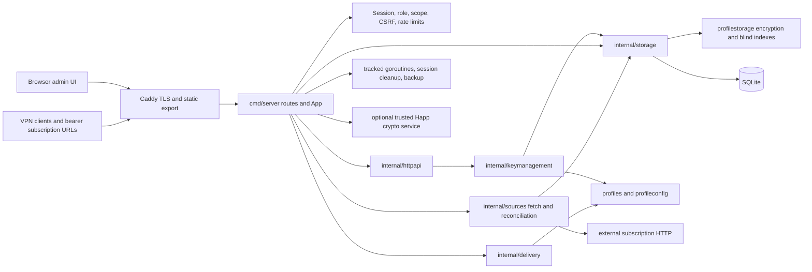

# Executive Summary

## Current implementation update — 2026-10-06

[PR #7](https://github.com/romanpodg/SubShare-Go/pull/7) is merged at **267811b**. Its R01 startup/WAL characterization, repository test health fixes and six passing checks are prerequisite evidence. The existing repository/settings/activation/device extraction is partial A01 progress.

**R02 implements the P0 correction:** initialization failures stop startup without application-side WAL deletion or automatic retry. See the [execution record](r02-startup-safety.md) for validation and its limits. R03/R05a/R05b have partial groundwork; R04 and all R06–R23 sub-batches remain unstarted. Continue with one PR per batch.

See the [current backlog status](refactoring-backlog.md#current-implementation-status--2026-10-06) and [batch status](refactoring-batches.md#current-completion-and-next-batch) for completed/remaining work and final CodeScene/Codecov/CI evidence. Measurements below remain a historical baseline at 3ab25a5, not current scores or live check status.

## Original audit baseline

Audit date: 2026-10-06, Asia/Omsk. Analyzed commit: **`3ab25a5d7aa4f2a28069330406d74f697ac1f1c3`**, branch **`main`**. The initial working tree was clean. After `git fetch origin --prune`, `HEAD` and `origin/main` were identical (0 ahead / 0 behind). No checkout, reset, clean, stash, production edits, commits, pushes, or PR creation occurred. Generated analysis and disposable databases remain under ignored `.cache/audit/`; frontend validation produced ignored build/test output.

The repository is a self-hosted VPN profile/subscription hub, not a VPN node controller. Its extracted protocol, key-management, encryption, and delivery boundaries are useful foundations. Most measured production files are healthy. The remaining high-risk work is concentrated in user/subscription mutations, revisioned profile persistence, frontend configuration editing, response rules, job orchestration, and duplicated authorization guards. Refactor those seams incrementally after characterization tests, rather than replacing the application architecture.

**One P0 is supported by direct evidence:** the SQLite startup retry deletes the WAL without proving it contains no committed data. A disposable experiment using the actual cleanup helper lost a committed row. Healthy CodeScene scores did not detect this correctness hazard. The audit does not establish how often the triggering filesystem error occurs in deployment.

The production coverage baseline at this exact SHA is **46.89% Codecov line coverage**. Local Go statement coverage is **51.5%** with CI-style package instrumentation and **67.0%** with cross-package instrumentation. These are different measurements. Zero coverage in extracted packages is partly an instrumentation artifact; mutation and startup gaps remain real after cross-package measurement. All executed application tests/checks passed. Docker deployment smoke, Linux-specific behavior, and the optional external-client/database-snapshot tests remain unverified locally.

See [refactoring-backlog.md](refactoring-backlog.md) for ranked root causes and required tests, [refactoring-batches.md](refactoring-batches.md) for independent execution boundaries, and [analysis-evidence.md](analysis-evidence.md) for the complete tracked-file inventory, scores, findings, exclusions, and coverage correlation.

# Analysis Coverage

| Scope | Result |
| --- | --- |
| Git-tracked files at the audited SHA | 355 |
| First-party production source | 211: 122 Go, 89 frontend TS/TSX |
| Production CodeScene reviews completed | 211; 198 numeric scores, 13 valid `score: null` results |
| Additional operational/configuration source reviews | 8 attempted; 7 completed, 2 numeric scores |
| Total CodeScene inputs / successful responses / numeric scores | 219 / 218 / 200 |
| Final CodeScene failures | 1: `.cjs` unsupported; no remaining production failures |
| Tracked files excluded from Code Health review | 136; individual reasons in the evidence inventory |
| Codecov files mapped to tracked production paths | 111 / 111; no unmatched paths |
| Local Go coverage files | 111; declaration-only and platform-excluded files have no executable coverage record |
| Tracked test source | 48 Go test files, 32 Vitest files, 1 Playwright spec; additional fixtures and harnesses |
| Git history | 77 commits, starting 2026-02-14; recent window 2026-04-06 through audit |

Discovery used `git ls-files`, not recursive filesystem discovery. All production Go/TS/TSX files were submitted, including unhealthy files and migration implementations. No tracked generated production source, vendor tree, or build output was found. Untracked/ignored `node_modules`, `.next*`, `out`, caches, coverage, runtime databases, and backups were excluded by design. Test files are reviewed for protection quality, not ranked as production Code Health debt. Shell scripts, YAML, CSS, assets, manifests, OpenAPI, and deployment configuration received contextual review; PowerShell scripts were submitted because this CLI supports `.ps1`.

CodeScene version: `1.0.47-SNAPSHOT (b23cf1c56f9b651dae4ab3ca900121b85c4e5376)`. Each input used `cs review --output-format json <tracked-file>`, programmatically, with four CLI processes. Two transient license-server failures (`jobs.go` and the subscription settings page) succeeded on retry. Null scores are not errors or zeros: they occur in declaration-only, re-export, documentation, and small configuration inputs. `cs delta main` reported **No modified files to check** before documentation creation. Scores are tool-version-specific observations, not acceptance thresholds.

## Validation evidence

| Check | Outcome and limits |
| --- | --- |
| `go test -json -covermode=atomic -coverprofile=.cache/audit/go-coverage.out ./...` | Pass; package-cache results allowed; 656 passing test/subtest events, 5 skips |
| `go test -count=1 -json -covermode=atomic -coverpkg=./... -coverprofile=.cache/audit/go-cross-coverage.out ./...` | Pass, uncached; resolves cross-package instrumentation ambiguity; 67.0% statements |
| Dedicated uncached migration idempotence test | Pass: `go test ./internal/storage -run TestMigrateAppliesVersionedMigrationsIdempotently -count=1` |
| `go vet ./...` | Pass |
| `go build -o .cache/audit/server.exe ./cmd/server` | Pass |
| `golangci-lint` | Not available on PATH or in checked conventional Go/tool locations; configuration and CI reviewed, no local lint result claimed |
| `npx tsc --noEmit --incremental false` | Pass |
| `npm run lint` | Pass |
| Vitest | 128/128 pass across 32 files; first sandbox run failed before test execution due to temporary-cache rename permissions; unrestricted retry passed |
| Next.js production build | Pass, static export; `NEXT_DIST_DIR=.next-validation` isolated framework build output |
| Existing Playwright runner after export build | 20/20 pass, desktop and mobile Chromium; API-mocked UI tests |
| Docker smoke | Not run: Docker Desktop Linux engine pipe absent; no live stack was touched |
| Race detector | Not run: local Go reports `CGO_ENABLED=0`, no `gcc` found; concurrency assurance is incomplete |

Local runtime versions: Go 1.26.0 and Node 24.16.0 on Windows. CI uses Go 1.24 and Node 22 on Linux, so a local pass is not evidence of identical Linux behavior. The five optional Go skips are the existing-database snapshot and official Mihomo, Sing-box, minimum-Xray, and current-Xray validations. Ordinary fuzz seed tests ran; sustained fuzzing was not performed. No dependencies or test/configuration files were edited or installed for the audit.

# Architecture Summary

## Packages and boundaries

| Package/module | Responsibility and important boundary |
| --- | --- |
| `cmd/server` | Executable/composition root plus most HTTP, user/subscription/settings SQL, authentication, audit events, jobs, public HTML, OpenAPI embedding; the principal remaining broad package |
| `internal/httpapi` | Key queries, revisioned profile/reveal/clone/category/admin handlers; strict bounded JSON and legacy/v1 envelopes |
| `internal/keymanagement` | Key commands, ownership/revision policy, typed patches, safe detail projection, categories and health-check service; one broad repository interface |
| `internal/storage` | SQLite adapter, encrypted key and source reconciliation writes, categories, delivery reads, migration/startup invariants; implements the key-management persistence seam |
| `internal/profiles` | Protocol registry, URI grammar, typed SS/Hy2/TUIC and legacy adapters, canonical serialization, sensitive values, keyed semantic fingerprints; fuzz/adversarial fixtures |
| `internal/profileconfig` | Legacy/Xray JSON interpretation, drafts, safe projections, URI helpers and bounded TCP/Hy2 availability probes |
| `internal/delivery` | Plain/base64/Xray/Mihomo/Sing-box rendering, format capability/exclusion policy, safe informational entries and metadata; no database/keyring access |
| `internal/sources` | Size-limited feed fetch, SSRF/DNS/redirect defense, format parsing, selection/identity/counting, and source reconciliation; currently imports concrete `storage.SourceSync` |
| `internal/security/password` | Argon2id hashing, bounded encoded-hash validation, bcrypt migration, password policy |
| `internal/security/profilestorage` | Authenticated credential encryption bound to row identity, blind indexes, strict keyring loading and platform-specific private-file checks |
| `internal/platform/configuration` | Startup environment parsing and validation before persistence/network startup |
| `internal/middleware` | Trusted-proxy global configuration, bounded per-IP rate limiter, request IDs, security/CORS/logging, static serving and legacy API deprecation |
| `internal/model` | Shared domain and request/response DTOs, statuses, optional/tri-state fields and settings |
| `internal/keypersistence`, `internal/profilepersistence` | Unreferenced duplicate interface/parameter/error definitions; no imports by tracked Go consumers found |
| `frontend/src/app` | Next App Router layouts and pages; root/admin provider composition with mostly client-driven administration screens |
| `frontend/src/lib`, `context`, `components` | Typed handwritten API contracts, module-global CSRF callback state, branding cache/context, profile conversion, UI/modal state and presentation |

Go package listing/build reveals no import cycle. The dependency direction issue is subtler: sources depend on a concrete storage transaction, while storage imports key-management types, and many other domain decisions remain on `App` next to SQL/HTTP. Do not introduce generic repositories or extra managers to remedy this. Existing seams can be narrowed where a tested caller requires it.

## Critical execution paths

1. **Startup and upgrade:** load/validate configuration → load keyring/fingerprint keys → SQLite pragmas → baseline/versioned migrations 0–19 → envelope/key-ID checks → bootstrap owner → interrupted-job recovery → workers → route registration. Startup retry/deletion, encryption migration batches, table rebuild/FK toggles, and keyring preservation are highest data-safety boundaries.
2. **Administration:** login password verification/optional rehash → hashed session identifier and CSRF token → role/scope guard → handler/service → SQLite → audit record. API token hashes are stored; secrets are returned once. Interactive sessions gate token creation/revocation. Public GET branding/config routes are deliberate for login/subscription pages.
3. **Profile mutation/reveal:** safe summaries/detail → explicit revisioned reveal or raw/structured patch → source ownership restrictions → transactional metadata/encrypted secret/blind-index update → safe DTO. Metadata-only edits must not rewrite secrets; clones use separate blind-index treatment. Frontend raw bytes, duplicates, unknown fields and secret clearing must survive extraction.
4. **Subscription:** one-time activation CAS → status/start/expiry access decision → effective global/user settings → ordered response rule → optional/mandatory HWID registration and limit → ordered assigned keys → decrypt/validate/deduplicate → capability-aware render → safe headers/template/Happ link. Activation/subscription IDs are bearer secrets. No payment processor, billing, commercial license, or entitlement-to-payment integration was found; subscription status/date/device policy is the business access logic.
5. **External source:** URL validation → SSRF-safe pinned DNS dial/redirect validation → 20s fetch/10MB cap → parse/preview/selected refs → source/key/category transaction → identity reconciliation, assignment migration, stale-key deletion and run counts. Jobs fetch outside the application reconciliation mutex; updates/retries/deletes can overlap.
6. **Operations:** recurring integrity-checked `VACUUM INTO` backup → temporary/previous file publication → export database plus matching keyring. Session cleanup/rate-limiter cleanup/backup tickers and job goroutines have no shared shutdown cancellation boundary.

Production Compose isolates the Go service behind Caddy, persists SQLite/keyring in `app-data`, serves Next.js static HTML/assets, and applies read-only roots, reduced capabilities and memory limits. Development uses Next rewrites to localhost:8080; the Go executable can also serve `frontend/out`. Shell/PowerShell bootstrap and backup scripts are deployment boundaries, not automatically covered by application unit tests. The optional Happ service is an operator-trusted network integration distinct from untrusted source feeds.

# Code Health Distribution

Descriptive audit bands (not a claim about universal CodeScene classifications): healthy `9–10`, problematic `7–<9`, unhealthy `<7`.

| Production band | Files | Interpretation |
| --- | --- | --- |
| Healthy | 151 | Includes the P0 startup/storage paths; does not establish correctness |
| Problematic | 36 | Inspect responsibilities and test risk before extracting methods |
| Unhealthy | 11 | All semantically reviewed; several contain necessary grammar/security complexity |
| No numeric score | 13 | Completed review with null score; excluded from numeric distribution |

The two additionally scored configuration/operational files are `next.config.ts` (healthy) and `scripts/start.ps1` (8.03). Worst production scores: frontend `configuration.ts` 2.36, `profiles/uri.go` 4.74, `profileconfig/xray.go` 5.48, `profiles/tuic.go` 5.59, `storage/profile_repository.go` 5.67. High-activity unhealthy files include `repository.go` (24 lifetime/16 recent commits), `profile_repository.go` (10/10), `subscription_rules.go` (10/10), and `KeysSection.tsx` (13/8). Their priority varies because coverage and domain meaning differ.

# Highest-Risk Files

Coverage below is **Codecov line coverage at the audited SHA**; frontend coverage is not uploaded/configured. Git activity is lifetime/recent touches and recent added+deleted lines. A grouped target owns one root-cause backlog item; repeated file references do not create duplicate work.

| Priority | File | Code Health | Git Activity | Coverage | Main Findings | Architectural Role | Test Risk |
| --- | --- | --- | --- | --- | --- | --- | --- |
| P0 A00 | `cmd/server/main.go`; `internal/storage/sqlite.go` | 9.57; 9.92 | 27/20, 1,311; 3/3, 115 | 8.01%; 60.78% | WAL deleted on broad I/O retry; metrics do not flag it | startup/persistent state | `openDatabase` 0% local; cleanup test asserts removal rather than committed-data preservation |
| P1 A01 | `cmd/server/handlers_users.go`; `repository.go`; `subscription_admin_v1.go` | 8.00; 6.33; 7.67 | 1/1, 427; 24/16, 1,609; 5/5, 518 | 2.14%; 57.31%; 39.51% | Low Cohesion, large mutation/scan/HWID functions, duplicated PUT/PATCH policy | account/access persistence | create/legacy subscription update/activation redemption 0% local; concurrency/failure gaps |
| P1 A02 | `internal/storage/profile_repository.go`; `keymanagement/update.go` | 5.67; 6.64 | 10/10, 1,767; 7/7, 754 | 64.07%; 35.51% | low cohesion plus metadata/patch/ownership/transaction complexity | credential-bearing key lifecycle | preserve ciphertext/revisions/assignment rollback; typed patch cases weakly covered |
| P1 A03 | `frontend/src/lib/configuration.ts` | 2.36 | 4/4, 1,830 | unavailable | patch CC 133, 394 executable LoC, 10 bumps, depth 4 | loss-preserving profile editor/converter | existing corpus valuable; missing full transport/security matrix and backend parity |
| P1 A04 | `cmd/server/subscription_rules.go`; `handlers_subscription.go` | 6.50; 7.56 | 10/10, 1,463; 1/1, 461 | 40.40%; 42.39% | low cohesion, rule validation/CRUD/render responsibilities | public delivery policy | malformed persisted rules, CRUD/template/header failures not fully protected |
| P1 A05 | `cmd/server/jobs.go`; `sources_v1.go` | 9.38; 7.79 | 11/11, 1,024; 11/11, 968 | 32.46%; 57.18% | job retry complexity; source create mixes HTTP/fetch/SQL/reconciliation | asynchronous state, destructive sync | queued workers/retry 0% local; source identity races need characterization |
| P1 A06 | `cmd/server/auth.go` | 8.24 | 12/8, 245 | 72.66% | duplicated admin/owner guard CSRF/scope logic | authorization boundary | sampled wrapper matrix is not exhaustive real-route coverage |
| P1 A07 | `frontend/src/components/admin/KeyEditorModal.tsx` | 6.20 | 5/5, 3,694 | unavailable | submit CC 117, 192 LoC, 6 bumps; many coupled draft/secret states | profile update/reveal client | failure/reopen/stale async response matrix missing |
| P1 A08 | `frontend/src/components/admin/KeysSection.tsx` | 6.71 | 13/8, 2,650 | unavailable | large card/row/category renderers and drag lifecycle | ordered/bulk administration UI | focused tests are sparse relative to drag/reorder/delete state |

# Architectural Findings

- **A01/A04: remaining broad `App` boundary is real, despite prior file splits.** HTTP handlers still perform validation, policy, SQLite operations, and audit side effects directly. `repository.go` combines user projection, settings, activation, access and device registration. Moving functions between files alone would leave this coupling intact. Extract one tested responsibility at a time.
- **A02: key adapter combines unrelated operations.** `profile_repository.go` is 1,084 lines and includes modern encrypted profile mutations, legacy CRUD, category administration and ordering. Its low cohesion signal matches actual independent responsibilities. Share transaction/credential primitives without hiding transaction ordering. `CreateLocal` ignores the automatic-user-assignment SQL result at lines 215–218, unlike `CloneLocal`; this is a concrete partial-success concern under a DB failure, not evidence that normal writes currently fail.
- **A05: source transaction and job lifecycle are spread across three layers.** `sources.Sync` uses concrete `storage.SourceSync`; server handlers create categories/start SQL transactions, workers fetch and record state, and `syncExternalSource` serializes only reconciliation. Safe deletion and fingerprint/duplicate repair are transactional today. Preserve those protections; overlap/out-of-order fetch results and post-commit response failures need deterministic tests before changing scheduling.
- **A06: repeated auth logic can drift.** `requireAdmin` and `requireSuperAdmin` duplicate token scope/CSRF enforcement. Scope routing uses path substrings and deny-by-default. No authorization bypass was established. A shared evaluated principal/policy pipeline should preserve owner aliases, token precedence, CSRF exemptions and response envelopes.
- **A09: contracts are handwritten in several places.** Go DTOs, `openapi.yaml`, frontend `types.ts`/`api.ts`, and direct fetches encode the same boundary. Key-route/OpenAPI checks exist, but do not cover all source/user/settings shapes or aliases. Contract fixtures/checks should precede any contract generation decision.
- **A11: dead compatibility interface packages.** The tracked tree has no imports of `keypersistence` or `profilepersistence`. Their types duplicate the active key-management seam. Treat them as removal candidates after confirming external consumer policy, not as future extension points. Live legacy HTTP/key adapters have actual compatibility responsibilities and should remain until retirement is authorized.
- **Cross-cutting consistency:** old/new error envelopes and log/slog usage differ; many audit/status helper writes deliberately ignore DB errors. Not every best-effort write should become request-fatal. Record the contract for essential persistence versus optional telemetry first. Context-free SQL and `context.Background()` often ignore request cancellation; package-global trusted-proxy and frontend auth callback state are hidden coupling, not demonstrated data races.

# Testing Findings

## Measured coverage and analytics

`CODECOV_API_TOKEN` was absent; no token value or upload token was accessed. Documented public read-only GET endpoints returned coverage for this exact SHA and `main`: **111 files, 14,884 measured lines, 6,980 hits, 6,807 misses, 1,097 partials, 46.89% coverage**. All paths mapped directly. The separate repository-detail endpoint returned `totals: null`; commit/branch totals and report endpoints contained the actual baseline. Do not mistake that nullable field for missing reports.

Codecov reported no branch counters (`branches: 0`). Line statuses (`0` hit, `1` miss, `2` partial) do not establish branch coverage. Exact file percentages and findings/line intersections are in the evidence appendix. Two file-report GETs independently verified the high-risk coverage values. The corrected documented daily trend request returned zero points for 2026-04-06–2026-10-06; no historical trend or coverage change is inferred. An initial request omitted required `interval` and returned 422; it was corrected. There is no production patch in this audit to evaluate.

The documented Test Analytics endpoint supplied all **803 records** for the SHA: **798 pass, 5 skip**, with flags backend 654, migration 1, frontend-unit 128, frontend-e2e 20. All records matched the SHA. The old test-results endpoint returned a 301 migration response; the working analytics endpoint was used instead. These are uploaded test records, not comparable one-for-one with Go parent/subtest events (656 passing events locally). The five optional skips match local skips. Historical flakiness, retry frequency, and failure trends were not exposed by the retrieved commit-scoped records. The slowest uploaded tests were UI smoke tests (~3.6–6.7 seconds); duration alone is not a reason to remove them.

CI currently uses Go package-local instrumentation. Thus Codecov `internal/sources/sync.go` is 0% and all `internal/delivery` files report 0%, even though server integration tests execute them. An uncached `-coverpkg=./...` run measured sync at **84.5% statements** and delivery `render.go` at **56.3%**. Backend Xray interpretation rose from 58.0% to 82.1% statements. These supplemental results expose measurement blind spots; they are not replacement Codecov values. Several true gaps persist: `apiCreateUser`, legacy subscription PUT, `redeemActivationCode`, `queueTrackedJob`, queued worker bodies, retry handler, and startup `openDatabase` are unexecuted in their owning package profile. No frontend coverage percentage is available from Vitest test counts.

## Protection by subsystem

| Subsystem | Existing protection | Missing or weak protection before refactoring |
| --- | --- | --- |
| Auth/authorization | credentials/password tests, token-scope tests, wrapper matrix, reveal authorization, hashing/CSRF characterization | exhaustive actual-route matrix and aliases; DB errors, expired cookie with bearer, principal changes, auth request races |
| User/subscription | state/device-policy matrices, optional-field/timezone PATCH tests, assignment all/selected tests | real user creation/deletion/PUT/activation routes; duplicate activation races, DB/commit failure, invalid references, concurrent disjoint PATCH semantics |
| Profile persistence | create/update/clone, key separation, metadata preserves secret, source ownership, error-classification tests | SQL fault injection around parent/secret/assignment; tri-state SS/Hy2/TUIC clears, stale revision races, post-commit reload failure |
| Parsing/delivery | adversarial and fuzz seed profiles; large multi-format server integration suite; template/header/security cases | focused package-level delivery/sync tests, backend/frontend fixture agreement, unsupported combinations and fail-closed boundaries |
| Sources/jobs | atomic create, duplicates, masked summaries, HWID updates, RBAC/delete/polling; health-worker aggregation/concurrency tests | real queued lifecycle/retry/shutdown, out-of-order source fetch, update/delete during fetch, status/audit SQL failure |
| Migrations/storage | idempotence, populated old schemas, rollback, migration 13 integrity, encryption startup/backup tests | real optional snapshot fixture, interrupted multi-batch encryption restart, disk I/O/WAL preservation, FK restoration on every failure |
| Frontend | 32 focused Vitest files plus mocked browser smoke | contract integration with real Go routes, request failure/abort/reopen ordering, destructive action and reorder failures, branding persistence acknowledgment |
| Deployment/scripts | CI Compose/Caddy/clean-stack/restart smoke | populated upgrade/restore/database+keyring pairing and custom backup paths; Windows/Unix operational parity |

Tests include strong semantic assertions: raw JSON unknown/dormant branches and duplicate-key preservation, metadata/ciphertext separation, source ownership, and exclusion policies. Preserve them. Large `FullSuite` tests and parent-level integration helpers make failure localization harder but are not useless duplication. Wrapper-only authorization tests and mocked E2E responses can pass while route registration or DTOs drift. Browser geometry/accessibility/drag tests belong in E2E; pure conversion/patch/failure decision matrices belong in unit tests. Mock assertions that check payload contracts are useful; call-count/timing assertions and overlapping broad happy-path tests should be reviewed case by case, not deleted wholesale.

# Frontend Findings

The frontend is a static export, with client components/providers owning authentication, API fetching, pagination, dialogs, draft state, and optimistic UI. Server/client boundaries are consistent with this deployment; converting screens to Next server actions would change the runtime boundary and is not a refactoring recommendation.

**A03/A07/A08 are real concentration problems.** `configuration.ts` mixes URI parsing, Xray document traversal, default construction, conversion, and selective patching; `KeyEditorModal` constructs protocol-specific commands while managing secret/draft/reveal/conflict state; `KeysSection` combines drag listeners/scroll, filtering/selection/order, destructive requests and two representations. Extract pure conversion/command builders and small state hooks before moving presentation. Avoid one repository-wide state-management migration.

**A12 is a localized correctness/feedback concern:** `PanelSettingsModal.tsx:69` tests `panelTitle !== settings.panelTitle && panelTitle === settings.panelTitle`, an impossible condition, so its documented open-state resynchronization cannot run. The branding page keeps the modal mounted. `PanelSettingsContext` setters optimistically update/cache and fire `saveToAPI` without surfacing its boolean; a failed PUT can appear successful locally and disappear after reload. These are source-established issues; network/UI behavior was not reproduced in this audit. Treat a correction as an explicit small behavior change, separate from extraction. Protect failed-write/reopen semantics first.

`api.ts` carries module-global CSRF/unauthorized callback state; branding uses direct fetch outside its common error path. Public config/types/defaults are duplicated with Go's public HTML renderer and frontend subscription blocks. A09/A14 should establish contract fixtures before selecting a shared source of truth.

## Bundle and loading boundary

CI uses the existing Turbopack export and Codecov asset analyzer; it does not provide module/import attribution. The SDK's Linux/macOS tooling was not installed on Windows or uploaded locally. A local read-only inventory of the successful export found **36 JS/CSS assets, 1,745,872 raw bytes and 473,717 summed gzip bytes**. Largest JS asset: 432,885 bytes raw / 82,818 gzip. These totals are the entire asset set, not one route's initial transfer, and exclude fonts/images. No module-size attribution or historical bundle regression is asserted.

The emoji picker already dynamically imports `emoji-mart` and data; do not recommend lazy-loading it as if it were eager. Root/global CSS fonts and broad editor imports merit inspection only if measured route transfer shows a problem. Correctness-preserving editor separation is the priority; bundle micro-optimization is not in the backlog.

# Backend Findings

The important extracted boundaries should be protected, especially the storage-only credential seam, safe projections/reveal, domain profile registry, and generator exclusion policies. `cmd/server/handlers.go` now has a healthy score after September splits, yet its 34 lifetime touches and 9,482-line historical churn identify lineage for the new handlers. A new filename's one touch is not evidence that the behavior is stable.

A01 combines user read mapping, policy and HTTP mutation concerns; A02 targets independent persistence responsibilities; A04 separates pure response decisions from persistence and HTTP; A05 stabilizes the worker/source lifecycle; A06 consolidates duplicated auth after route tests. A10 is a narrower Xray traversal/interpretation cleanup following shared fixtures. A13 addresses operational/migration failure assurance before modifying backup/rebuild code. Do not move SQLite transactions to an interface merely to conceal ordering or tighten complexity scores.

# Static Analysis Correlation

`.golangci.yml` enables standard errcheck/govet/ineffassign/staticcheck/unused plus gocyclo (20), gocognit (30), funlen (120 lines/80 statements), nestif (6) and maintidx (under 20). Complexity checks exclude test files; generated exclusions are lax; deferred transaction rollback is explicitly exempted. CI uses golangci-lint v2.13.2 with `only-new-issues: true`, so a future green PR lint result would not prove that the historical complexity backlog is absent. No local golangci result is available; no diagnostic is invented from its thresholds.

Frontend ESLint uses Next core-web-vitals and TypeScript presets, excluding framework/export output. TypeScript is strict with isolated modules and bundler resolution. Local Go vet, TypeScript and ESLint passed. The impossible branding resync predicate still exists despite a clean lint/type baseline; semantic state tests are needed. Explicitly ignored SQL errors in profile assignment and job state also require fault tests rather than assuming clean vet proves correctness.

Independent signals support A01/A02/A04: source responsibility mixing matches CodeScene low cohesion, repeated path activity/churn and measured mutation/failure coverage gaps. A03/A07/A08 combine repeated method complexity with large recent edits and incomplete failure/state protection, but lack measured frontend coverage. A05 and A00 are stronger semantic/test-risk findings than their healthy scores suggest. URI/password complexity has strong test evidence and low relative change frequency, so an isolated threshold breach is lower priority. No additional compiler/type/lint warning raises the priority of any item in this audit.

# Security/Correctness Risks

## Confirmed P0 A00: startup WAL deletion

Source: `cmd/server/main.go:101–112`, `internal/storage/sqlite.go:87–103`. Initialization/migration failure with generic `disk i/o error` or `(4874)` calls `CleanupSQLiteSidecars`, which removes `-shm` and **`-wal`**, then reopens/migrates. The code does not prove a successful checkpoint, prove exclusive access, preserve the WAL, or distinguish committed WAL records from disposable state. The existing cleanup test writes arbitrary `wal`/`shm` bytes and asserts removal.

A disposable subprocess created/checkpointed a schema, disabled automatic checkpointing, committed one row, and exited without clean close. Two copies of its DB/WAL/SHM were compared. Preserved sidecars: **1 committed row**. After the actual repository helper: **0 committed rows**. Only `.cache/audit/wal-probe/` was touched. This proves the destructive helper's consequence, not the production trigger frequency or that every failed SQLite close leaves a WAL. SQLite explicitly treats the WAL as persistent database state until checkpointing; normal close can checkpoint, but close/I/O failure cannot be assumed to do so. [SQLite WAL documentation](https://sqlite.org/wal.html#the_wal_file).

Recommended first batch is tests only (R01). Any change that stops automatic destructive recovery is a separately identified correctness repair (R02), not a behavior-preserving extraction. Preserve normal startup/migration/bootstrap, data and useful errors; do not preserve loss of committed data as a compatibility requirement.

## Other risks, without exaggerated severity

- No demonstrated additional authorization bypass, cryptographic break, plaintext profile-secret exposure, or concurrent over-limit device registration was found. Existing session hashing, scope deny-by-default, source URL masking, SSRF DNS pinning, encrypted profile storage, reveal guards and public escaping are important protections.
- Essential assignment SQL ignored in `CreateLocal` can produce partial business success if that statement fails. Concurrent subscription PATCH and out-of-order source fetches lack version checks around their earlier reads. These justify targeted fault/race tests and P1 boundary work, not unsupported claims of production corruption.
- Startup envelope verification inspects envelope shape/key availability and missing-parent secrets, not every credential's authentication tag. Per-read decrypt and backup verification are separate protections. Name/document that distinction; do not claim startup cryptographically verifies all ciphertext.
- Source URLs, activation/subscription identifiers, HWIDs and user records remain sensitive persistence even where profile credentials are encrypted. Treat the database/keyring/exports as private. No real secret-bearing runtime files were read during this audit.
- Background operations use detached contexts and best-effort tracking writes. Shutdown/status consistency and duplicate requests deserve characterization; no serious data race is established. Race validation needs an appropriate CGO/Linux runner.

# CodeScene False Positives / Acceptable Complexity

| Finding | Semantic decision | Recommended treatment |
| --- | --- | --- |
| `profiles/uri.go` 4.74: port grammar, canonical query, duplicate warnings, percent encoding | Mostly unavoidable domain complexity; 88.62% Codecov / 93.2% local statements, only 2 touches. Stable ordering of duplicate values is a connectivity requirement | Keep grammar and duplicate/encoding policy together; optional small named predicates, no parser replacement or score-driven splitting |
| `profiles/tuic.go` 5.59 and `hysteria2.go` 8.21: protocol/version/field validation | Mostly domain complexity, supported by protocol/adversarial tests; v4 compatibility must remain raw-only | Add uncovered combinations if changing protocol support; no mandatory parser rewrite |
| `password/hasher.go` 6.35: bcrypt/Argon2id branches and duplicate parsing decisions | Acceptable security algorithm boundaries, not interchangeable duplicated business policy | Preserve validation bounds/timing/error non-disclosure; only extract proven shared decoding after security tests |
| `profilestorage/keyring.go` 8.28: encryption/blind-index decoder duplication | Intentional similar checks with different key roles and shared material separation | Do not collapse key roles to improve duplication score; narrow a validated helper only if it makes role separation clearer |
| `main.go` route wiring and startup/CLI branches | Composition/orchestration and explicit endpoint policy are useful; this file's P0 is independent of method complexity | Do not hide route permissions in a generic dispatcher solely for metrics |
| `storage/migrations*.go`: SQL tables, rebuilds, migration callback arguments | Historical compatibility/data transformation complexity; immutable migration identity/order matters more than file length | Tests first; avoid rewriting already-applied SQL or altering transaction/FK boundaries |
| `backup.go` 9.61: nested publish/restore logic | Acceptable sequencing of failure/rollback checks; some failure paths need tests | Keep the rollback path readable; do not invent a generic filesystem framework |
| Go HTTP helper argument/string findings; primitive-obsession findings on URI/config data | Often language/framework or actual wire-format requirements | Use a domain type only when it enforces a real invariant; do not wrap every string/ResponseWriter |
| `KeyEditorModal`/`configuration.ts` high CC | Real local/state design problems, with some necessary protocol complexity | Extract coherent protocol/document phases and state transitions; preserve unknown fields and raw semantics |
| `profile_repository.go`, `repository.go`, `subscription_rules.go` Low Cohesion | Genuine architectural responsibility mixing verified in source | Split around narrow tested responsibilities, not around arbitrary line limits |

Null scores, clean static checks, declaration-only interfaces, and healthy scores do not invalidate semantic issues. Conversely, no file is recommended for refactoring solely because it has a low score.

# Priority Model, Uncertainty, and Audit Self-Check

Ranking is qualitative: demonstrated data loss first; then critical mutable business/credential boundaries with coverage gaps; then repeated complexity and active change in editor/delivery/job/auth seams; then isolated/tested cleanup. Scores, finding details, change frequency/churn, tests, coverage, blast radius, security and likely future edits are interpreted together. No arbitrary weighted score is used.

Churn is added+deleted lines, includes initial additions/moves/refactors, and uses current tracked paths without automatic rename attribution. Small-commit co-change counts exclude commits touching more than 20 files to reduce broad-refactor noise. Bug-fix commit labels are heuristic subject matches, not proof of a file-level bug. There are only 77 commits; recent and lifetime windows overlap substantially. Low-churn newly extracted handlers inherit risk from their historical parent.

Each P0/P1 item was inspected in source, linked to measured findings and existing tests, and given a prerequisite test plan. Overlapping symptoms are grouped by root cause. Source-established defects and inferred race/failure risks are labeled distinctly. No Codecov line values were substituted with local statements. No historical flakiness, missing branch data, Linux validation, Docker results, or unsupported analyzer output was invented. Batch scope and rollback boundaries are explicit; all behavior-preserving batches require contract parity. Corrective behavior changes are identified separately.

Official endpoint references used: [commit totals](https://docs.codecov.com/reference/repos_totals_retrieve), [line report](https://docs.codecov.com/reference/repos_report_retrieve), [file report](https://docs.codecov.com/reference/repos_file_report_retrieve), [coverage trend](https://docs.codecov.com/reference/repos_coverage_list), [Test Analytics](https://docs.codecov.com/reference/repos_test_analytics_list-1). These define retrieval mechanics; the observed numerical results above came from read-only requests to this repository.
